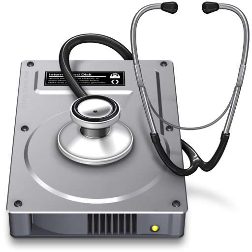
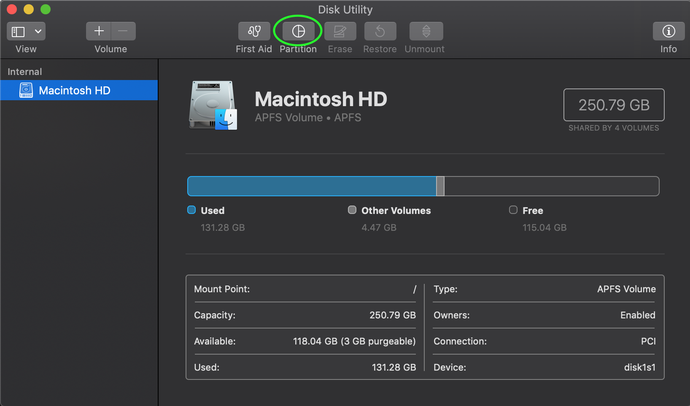
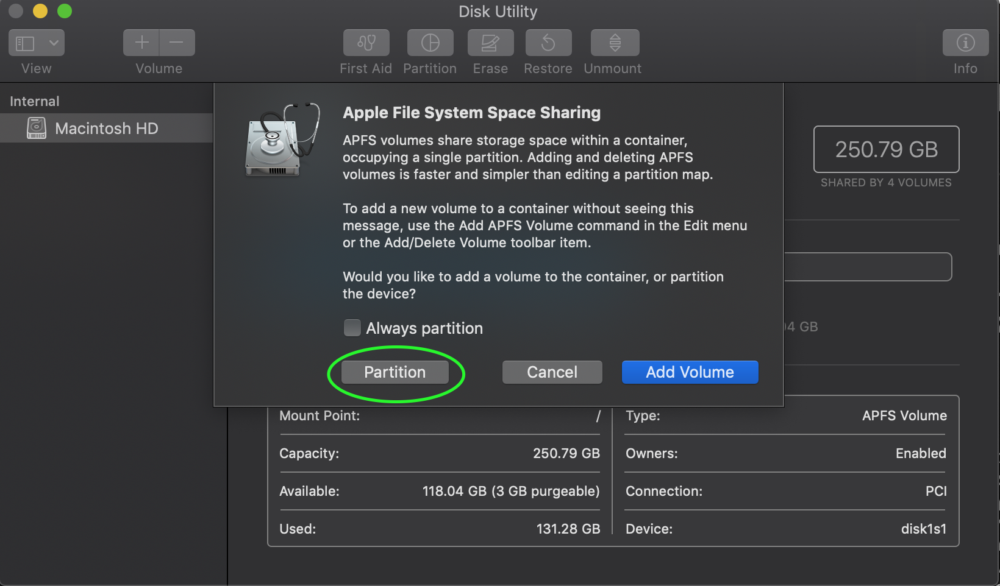
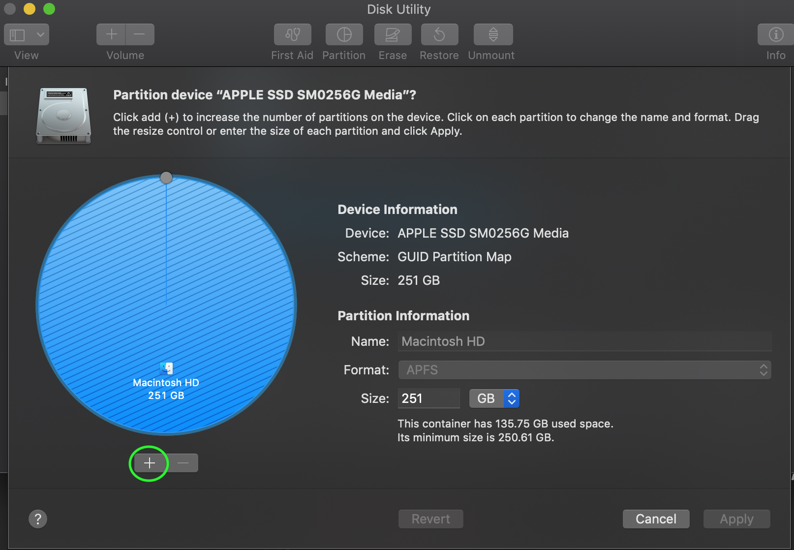
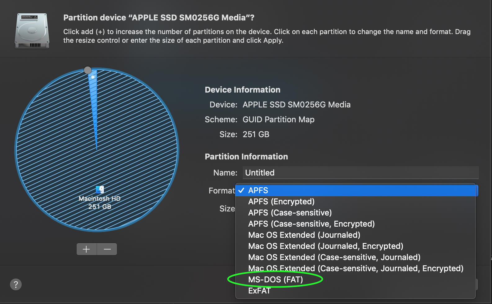

# Partitioning Your Mac
---

## Purpose of partitioning

The goal of partitioning your HDD/SSD is to create a defined space where your Linux OS will live. Both your Linux OS and MacOS are stored on the same drive but they each exist inside their own container, otherwise known as their "partition".  

## Partitioning with Disk Utility

Go ahead and open up Disk Utility located in /Applications/Utilities.

Next, you need to select your Mac's main drive then click on the button that says "Partition"

Next, you should see a prompt asking you if you'd like to create an APFS Volume or legitemately partition your drive.  Click "Partition".

After that, you should see a pie chart that shows your drive's partitions.  Assuming you have no other partitions on your system, the pie chart should be completely filled in.  Click on the "+" below the pie chart.

Once you've clicked the "+" you'll notice you now have a new adjustable partition in your pie chart. Adjust the size of this partition to the  amount of storage you wish to give your Linux OS.  I recommend a minimum of 25 GB as the Linux system files will take a significant chunk of this storage.

Next, where it says "Format:" you need to select MS-DOS (FAT)

Then you can name the partition whatever you want and click "Apply"

### Did it work?

If everything worked fine and you received no errors then you are ready to move on to the next step.  However, if you're like me and this process did not go as planned then please read the rest of this page.

## Understanding and Troubleshooting APFS

### Quick Backstory

During the making of this tutorial I came across an issue where Disk Utility wouldn't let me create a new partition. I found out that this was caused by Apple's new filesystem, APFS. I've never experienced this problem before which is why I think this is a great example of a typical "Apple-specific" roadblock that you may encounter.  Your situation could be different than mine but I'm just going to show you how I fixed this in my own specific situation and hopefully it will help you too.

### What is APFS?

APFS is Apple's new proprietary filesystem that was first included with MacOS High Sierra.  APFS partitions act like "resizable containers".  APFS allows you to resize your partition without the need to format the partition. You can also quickly and easily add and remove APFS Volumes within your APFS container.

### Whats the problem?

APFS is great new technology if you plan to only use it with Apple software.  However, you can't install your Linux OS on an APFS partition as its necessary to have your Linux partition formatted to the FAT32 filesystem.

In my situation, I figured out there was an APFS container that contained my entire 250GB SSD even though my MacOS system was only using 100GB of space.  Disk Utility wouldn't let me partition my drive because the 250GB APFS container left no room my Linux partition.

### Solution

We will be using the command line to resize our APFS container so head into /Applications/Utilities and open up Terminal.

First, we need to list our APFS containers to figure out which one we need to resize.  Type the following command into Terminal.

`diskutil apfs list`

You should see something like this:

