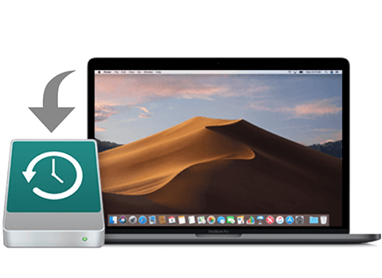
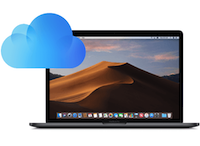

# **Preparation**
___
### **Are You Prepared to Become a Linux _*Distro-Hopping_ Badass?**

> ##### _*Distro-Hopping_   -   *Short for "distribution hopping" - can be defined as the process of switching between multiple Linux distributions in an effort to experience the various different environments Linux has to offer.*

## Getting Organized
###  **Step 1. BACK UP!**

**BACK UP YOUR DATA!**

**BACK UP YOUR DATA!**

**BACK UP YOUR DATA!**

People, I cannot stress this enough, if you are attempting to dual boot your Mac you seriously have to BACK UP YOUR DATA! Even if you have done everything exactly correct there is still a chance you could lose everything. So, unless you want to lose your secret collection of anime I highly suggest you BACK UP YOUR DATA!

#### Ways to back up your data:
**1. Time Machine**

  Time Machine is a program that comes standard with MacOS and it allows you to copy and restore full bootable backups of your MacOS system.

#### [Apple's official guide to using Time Machine](https://support.apple.com/en-us/HT201250)

**3. Carbon Copy Cloner**

Carbon Copy Cloner is a paid application that allows you to save and restore bootable backups of your MacOS system with the option to store your data remotely on their servers or locally on an external drive.

*NOTE - Both Time Machine and Carbon Copy Cloner create and store "bootable backups" which means you'll be able to completely restore your system if anything goes wrong.*

#### [Carbon Copy Cloner home page](https://bombich.com/)

**3. iCloud Drive**

iCloud Drive is cloud based data backup system that comes standard with MacOS. This is a great option for simply backing up your media rather than every file on your system.

#### [Apple's official guide to using iCloud Drive](https://support.apple.com/en-us/HT204025)

**4. Other Cloud Based Options**

* [Dropbox](https://www.dropbox.com/?landing=dbv2)

* [Google Drive](https://www.google.com/drive/)

* [Box](https://app.box.com/login)

*NOTE - iCloud, Dropbox, Google Drive, and Box do not allow for the creation of "bootable backups" and should only be used for storing personal files rather than storing the entire OS.*

## What you need
* Required

  1. Mac Computer
  2. 8GB Flash drive
  3. Patience

* Optional

  1. A second computer
  2. An external drive for backups
  3. Beer

## [Next Page]()
## [Back](Introduction.md)
