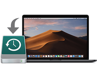

# **Preparation**
___
### **Are You Prepared to Become a Linux _*Distro-Hopping_ Badass?**

> ##### _*Distro-Hopping_   -   *Short for "distribution hopping" - can be defined as the process of switching between multiple Linux distributions in an effort to experience the various different environments Linux has to offer.*

## Preparing your Mac
####  Step 1. BACK UP!

BACK UP YOUR DATA!

BACK UP YOUR DATA!

BACK UP YOUR DATA!

People, I cannot stress this enough, if you are attempting to dual boot your Mac you seriously have to BACK UP YOUR DATA! Even if you have done everything exactly correct there is still a chance you could lose everything. So, unless you want to lose your secret collection of anime I highly suggest you BACK UP YOUR DATA!

#### Ways to back up your data:
1. Time Machine

  Time Machine is a program that comes standard with MacOS and it allows you to copy and restore full backups of your MacOS system.

##### [Apple's official guide to using Time Machine](https://support.apple.com/en-us/HT201250)

2. iCloud

## [Next Page]()
## [Back](Introduction.md)
