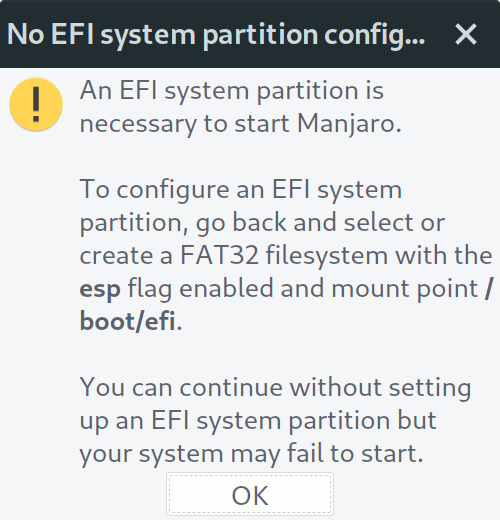
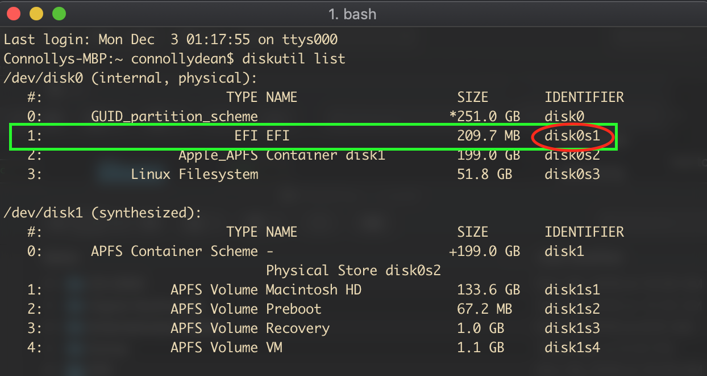
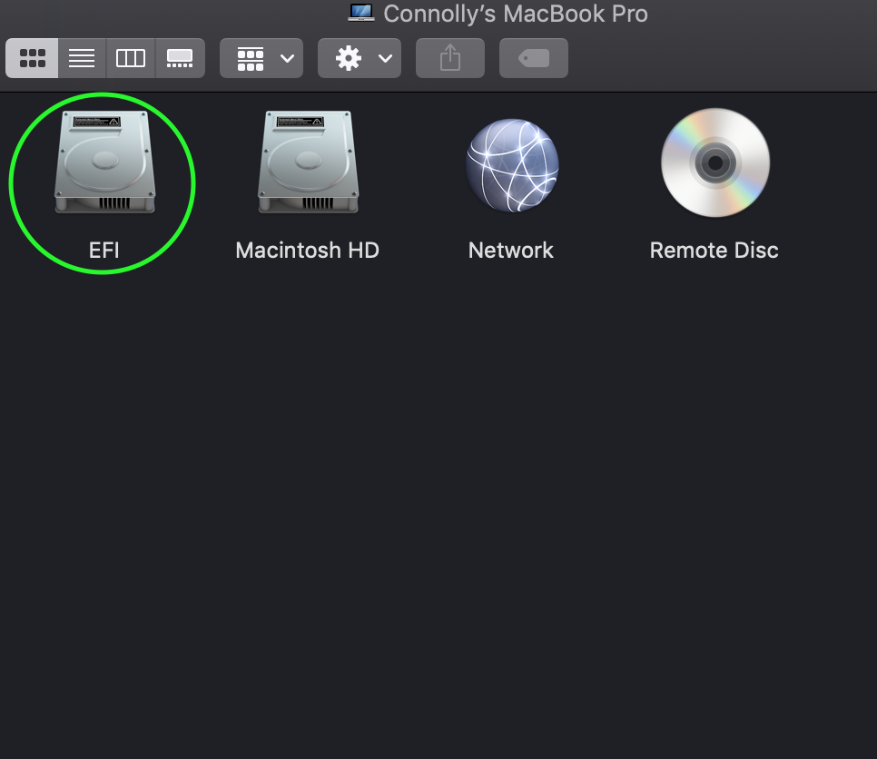
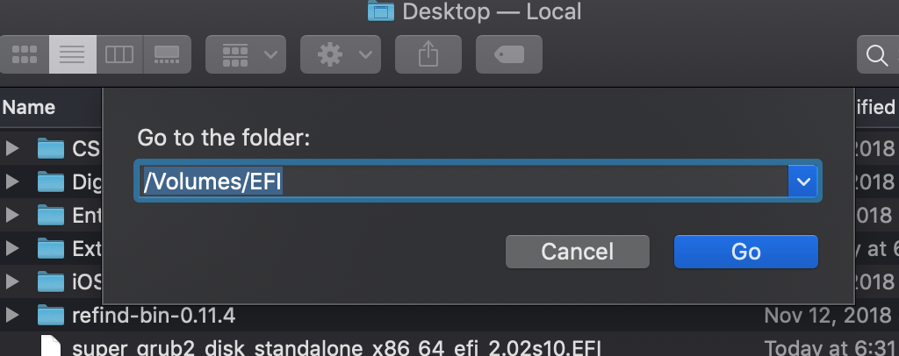
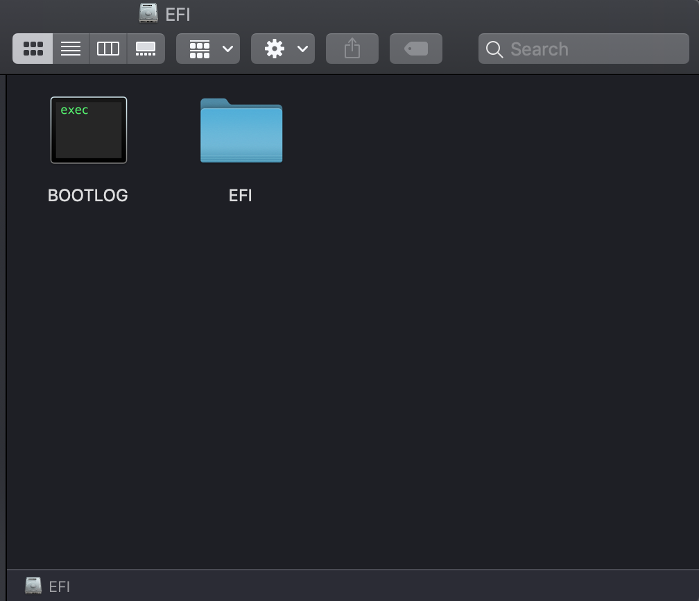
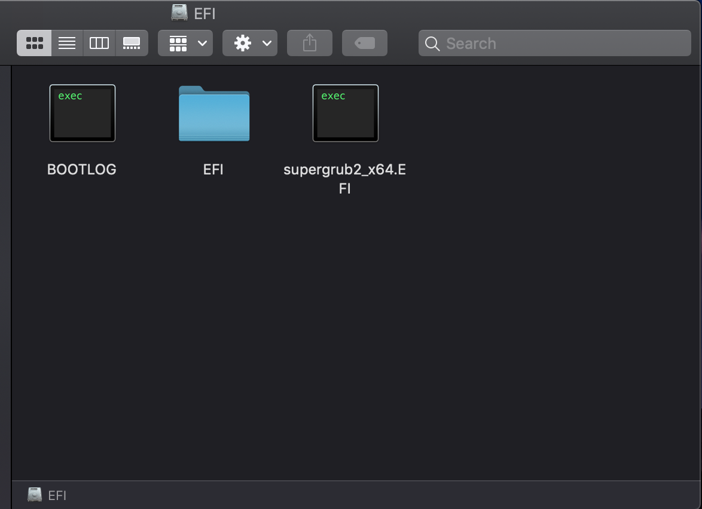

## How To Get Linux To Boot
***

### Getting rEFInd To Detect Your Linux Partition

Since you've successfully installed Linux on your partition, you can unplug your USB and reboot your computer and you should see something like this:

#### What The Fedora?!?!

As you can see, rEFInd is not detecting our Linux install. this is due to the following warning we saw on the previous page:

This warning means we didn't map our Linux install to our EFI partition. While it's possible to map this during our Linux install, I find the following alternative method to be easier and more versatile for future Linux installs.

### Installing Super Grub2 Disk

Super Grub2 Disk description:

> Super GRUB2 Disk helps you to boot into most any Operating System (OS) even if you cannot boot into it by normal means.

You can think of Super Grub2 as a back up to rEFInd.  Super Grub2 does a much better job at detecting bootable drives on your system and its a great tool to keep around for future troubleshooting.

### Option 1: Creating a bootable Super Grub2 live USB drive

First, download the Super Grub2 Disk x86_64 .ISO file from [this link](https://sourceforge.net/projects/supergrub2/files/2.02s10/super_grub2_disk_2.02s10/super_grub2_disk_x86_64_efi_2.02s10.iso/download).

Next, simply follow the same process from the [Creating A Bootable Linux USB Drive page](linuxusb.md), except replace your Linux .ISO file with the Super Grub2 Disk .ISO file.

You can now use this live USB drive to access the Super Grub2 menu any time the USB drive is plugged in.

### Option 2: Installing Super Grub2 Drive as a standalone .EFI file

With this method well be installing Super Grub2 as a permanent boot option that we can access at any time from the rEFInd start up menu. I recommend this option over the live USB option as I find having Super Grub2 as a permanent boot option to be more useful than a live USB.

First, download the Super Grub2 Disk EFI x86_64 standalone version from [this link](https://sourceforge.net/projects/supergrub2/files/2.02s10/super_grub2_disk_2.02s10/super_grub2_disk_standalone_x86_64_efi_2.02s10.EFI/download).

Next, we need to rename our file to help rEFInd identify the Super Grub2 EFI file as a bootable option.

For me, the original name of the Super Grub2 EFI file is the following:

`super_grub2_disk_standalone_x86_64_efi_2.02s10.EFI`

go ahead and rename this file to something like this:

`supergrub2_x64.EFI`

It doesn't matter what you name it, it just needs to end with `_x64.EFI`

#### Mounting Your EFI Partition

To install the Super Grub2 EFI file we need to move it to the EFI partition.

To do this, we need to open up Terminal and find the location of our EFI partition.  To do this type the following command:

`diskutil list`

And you should see something like this:

Find the partition thats named "EFI" and take note of the identifier. In my case, its "disk0s1".

Next, we need to mount this partition so we can add our Super Grub2 EFI file to it. To mount the partition, type the following command:

`sudo diskutil mount disk0s1`

You should see something like this in your terminal window:

> Connollys-MBP:~ connollydean$ sudo diskutil mount disk0s1   
Password:   
Volume EFI on disk0s1 mounted

Next, if you open up Finder, you may notice a new drive has appeared named "EFI" like so:

If you don't see this, try pressing `Command + Shift + G` and type "/Volumes/EFI/" like so:

You should now be inside the EFI partition which should look like this:

Next, simply drag and drop the Super Grub EFI file inside this directory like so:

