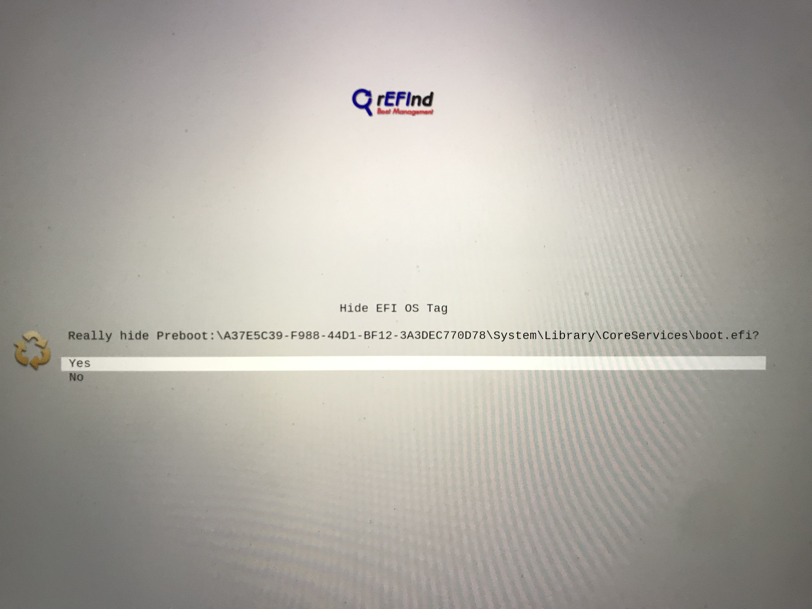

## Customizing rEFInd
***

### Removing Unwanted Boot Options

For the sake of clarity, I had my unwanted rEFInd boot options hidden throughout the making of this tutorial.

If I hadn't hidden my unwanted boot options, my rEFInd start up menu would look something like this:

These extra boot options are a result of rEFInd detecting all of the APFS volumes on your system.

To remove any unwanted boot options simply highlight the unwanted option and hit the minus key. After this you should be greeted with a prompt that looks like this:

After removing all of your unwanted boot options you should be left with something like this:

***
### Theming rEFInd
