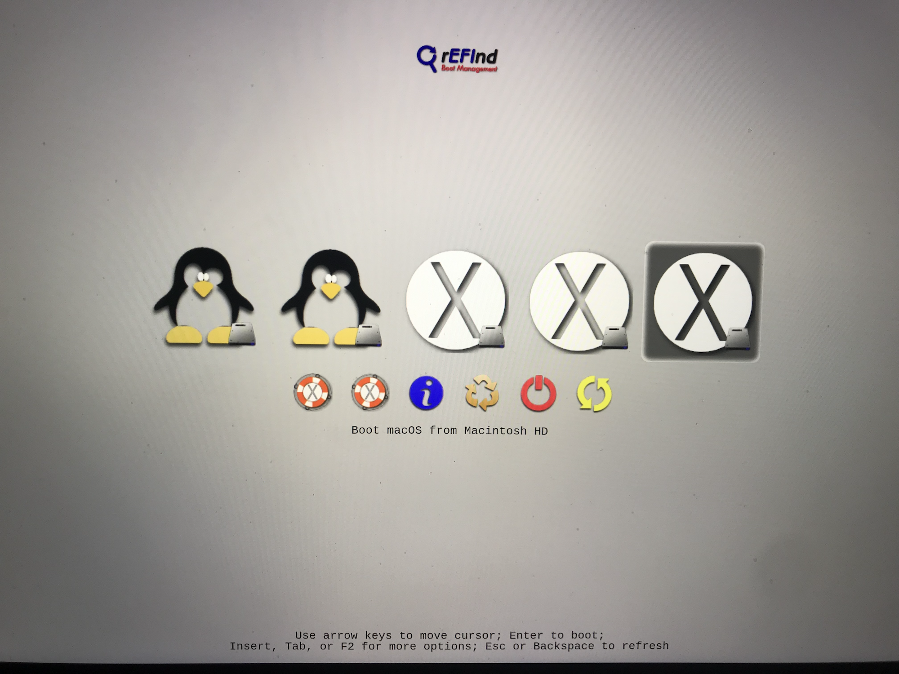

## Final Touches
***

### Customizing rEFInd

For the sake of clarity, I had my unwanted rEFInd boot options hidden throughout the making of this tutorial.

If I hadn't hidden my unwanted boot options, my rEFInd start up menu would look something like this:

These extra boot options are a result of rEFInd detecting all of the APFS volumes on your system.
