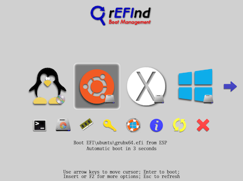

# Installing rEFInd on MacOS
***

## About rEFInd

rEFInd is a custom boot manager designed for UEFI based computers. rEFInd detects bootable drives on your system and displays them in a menu as shown below. We'll be using rEFInd to select your OS during every start up.

## Disabling System Integrated Protection

Before we can install rEFInd, we have to temporarily disable System Integrated Protection (SIP).  SIP is security technology that helps protect your Mac from malicious software by limiting access to certain parts of MacOS.

[Here's more info on SIP](https://support.apple.com/en-us/HT204899)

To disable SIP we need to boot into Recovery Mode. SIP can only be disabled from Recovery Mode but you can check the status of SIP by using the terminal command `csrutil status`.   

To disable SIP, shut down your Mac and boot up again while holding `⌘ + R`.  Once you've booted into Recovery Mode, click on Utilities and open up Terminal as shown below.

Next, simply type `csrutil disable` into the terminal and hit enter.  After this you can restart your system by typing `reboot` into the terminal.

Finally, once your Mac reboots use the command `csrutil status` to check if you've successfully disabled SIP.  You should see the following:

>Connollys-MBP:~ connollydean$ csrutil status   
System Integrity Protection status: disabled.
