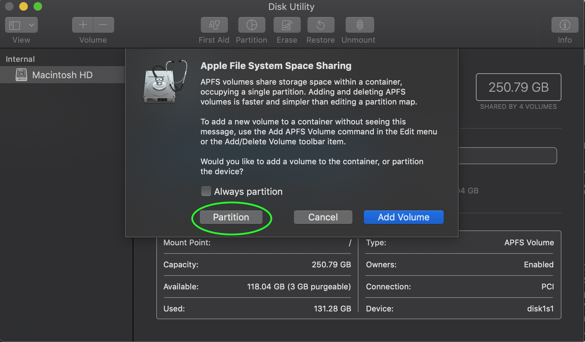
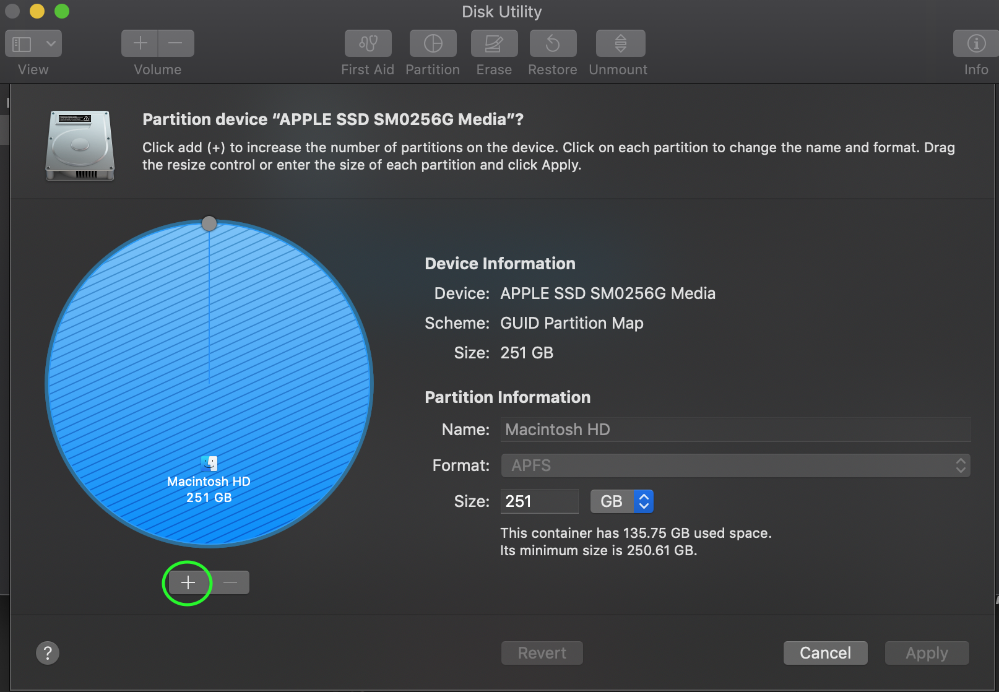
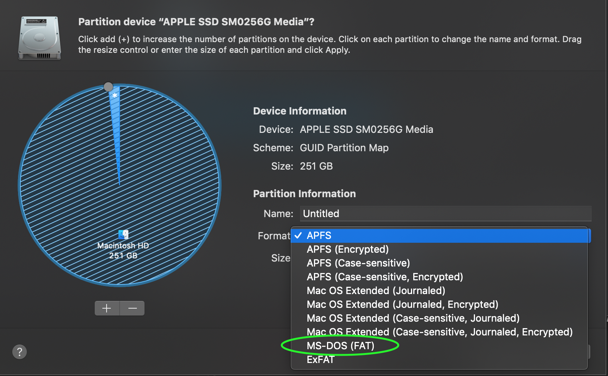
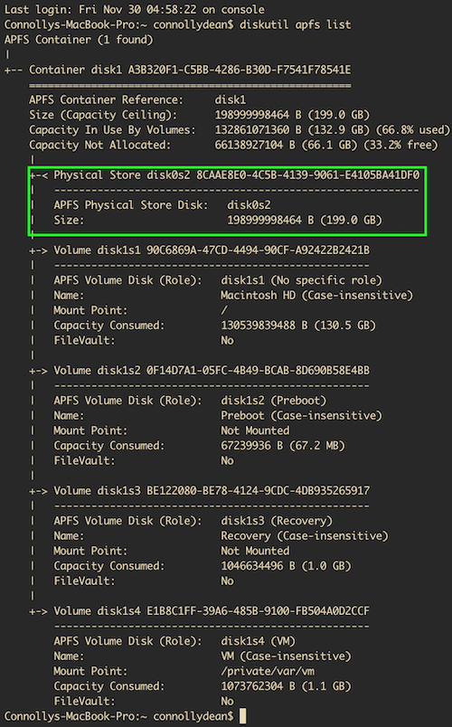
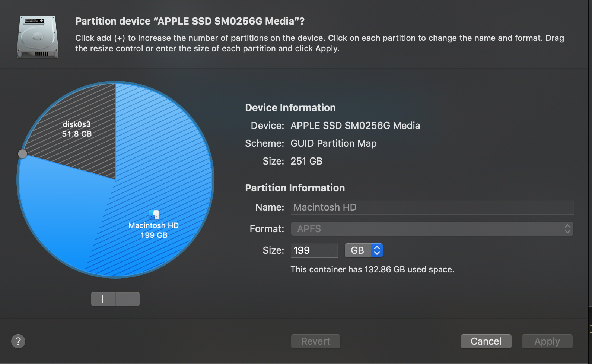

# Partitioning Your Mac
---

## Purpose of partitioning

The goal of partitioning your HDD/SSD is to create a defined space where your Linux OS will live. Both your Linux OS and MacOS will be stored on the same drive but they will each exist inside their own defined space, otherwise known as their "partition".  

## Partitioning with Disk Utility


Go ahead and open up Disk Utility located in /Applications/Utilities.

Next, you need to select your Mac's main drive then click on the button that says "Partition"


Next, you should see a prompt asking you if you'd like to create an APFS Volume or legitimately partition your drive.  Click "Partition".



After that, you should see a pie chart that shows your drive's partitions.  Assuming you have no other partitions on your system, the pie chart should be completely filled in.  Click on the "+" below the pie chart.



Once you've clicked the "+" you'll notice you now have a new adjustable partition in your pie chart. Adjust the size of this partition to the  amount of storage you wish to give your Linux OS.  I recommend a minimum of 25 GB as the Linux system files will take a significant chunk of this storage.

Next, where it says "Format:" you need to select MS-DOS (FAT)

Then you can name the partition whatever you want and click "Apply"



### Did it work?

If everything worked fine and you received no errors then you can head down to the bottom of this page. However, if you're like me and this process did not go as planned then please read the following section.

## Partitioning with Terminal and Troubleshooting APFS

### Quick Backstory

During the making of this tutorial I came across an issue where Disk Utility wouldn't let me create a new partition. I found out that this was caused by Apple's new filesystem, APFS. I've never experienced this problem before which is why I think this is a great example of a typical "Apple-specific" roadblock that you may encounter.  Your situation could be different than mine but I'm just going to show you how I fixed this in my own specific situation and hopefully it will help you too.

### What is APFS?

APFS is Apple's new proprietary filesystem that was first included with MacOS High Sierra.  APFS partitions act like "resizable containers".  APFS allows you to resize your partition without the need to format the partition. You can also quickly and easily add and remove APFS Volumes within your APFS container.

### Whats the problem?

APFS is great new technology if you plan to only use it with Apple software.  However, you can't install your Linux OS on an APFS partition as its necessary to have your Linux partition formatted to the FAT32 filesystem.

In my situation, I figured out there was an APFS container that contained my entire 250GB SSD even though my MacOS system was only using 100GB of space.  Disk Utility wouldn't let me partition my drive because the 250GB APFS container left no room for my Linux partition.

### Solution

We will be using the command line to resize our APFS container so head into /Applications/Utilities and open up Terminal.

First, we need to list our APFS containers to figure out which one we need to resize.  Type the following command into Terminal.

`diskutil apfs list`

You should see something like this:



On your system, find the container that says "APFS Physical Store Disk" and take note of the disk number.  For me it was "disk0s2" but it could be different for you. This is the container we need to resize to make room for our Linux partition.

Since I have a 250GB SSD I'm going to resize my APFS container to 200GB with the remaining 50GB to be used for my Linux partition.

We can resize this container and create our Linux partition with the following command:

`sudo diskutil apfs resizeContainer disk0s2 200g FAT32 LINUX 0b`

In the previous command you can see we are resizing container "disk0s2" to 200GB and we are creating an additional FAT32 partition named "LINUX" with a size of 0 bytes.  I used 0 bytes for the size as the command will automatically allocate the remaining 50GB of space on my drive to the LINUX partition.

### [Here's more info on resizing APFS containers](https://www.macobserver.com/tips/deep-dive/resize-your-apfs-container/)

## Time Machine APFS Snapshot Error?

If you used Time Machine to backup and the above command fails you may see an error that looks something like this:

```
Error: -69531: There is not enough free space in the APFS Container for this
operation due to APFS limits or APFS tidemarks (perhaps caused by APFS Snapshot
usage by Time Machine)
```

As far as I can understand "APFS Snapshots" are snapshots of your entire system to be used by Time Machine as restoration points. These hidden files prevented me from resizing my APFS container so therefore need to be deleted.

You can list your APFS snapshots by running the command `tmutil listlocalsnapshots /`

You should see something like this:

```bash
$ tmutil listlocalsnapshots /     
com.apple.TimeMachine.2018-01-30-194719   
com.apple.TimeMachine.2018-01-30-211627   
com.apple.TimeMachine.2018-01-30-224917   
com.apple.TimeMachine.2018-01-30-234619
```
To delete these snapshots we need to run the following command: `sudo tmutil deletelocalsnapshots`

It's ok to delete these files as Time Machine won't need them since you already backed up your data to an external drive.

You need to run this command for every snapshot on your system as shown below.

```bash
$ sudo tmutil deletelocalsnapshots 2018-01-30-194719  
Deleted local snapshot '2018-01-30-194719'  
$ sudo tmutil deletelocalsnapshots 2018-01-30-211627  
Deleted local snapshot '2018-01-30-211627'    
$ sudo tmutil deletelocalsnapshots 2018-01-30-224917  
Deleted local snapshot '2018-01-30-224917'    
$ sudo tmutil deletelocalsnapshots 2018-01-30-234619  
Deleted local snapshot '2018-01-30-234619'    
```
Once these snapshots are removed, you should now be able to resize your APFS container.

*NOTE - after completing this process I've come to the conclusion that that Disk Utility was most likely preventing me from adding a new partition solely due to the Time Machine snapshot error.  Therefore it may not be necessary to resize your APFS container from the command line.*

## Result

Whether you used Disk Utility or the command line to partition your drive, the results should be the same.

Disk Utility should display something like this if you correctly partitioned your drive:



***

## [Next Page: Installing rEFInd on MacOS](macrefind.md)

## [Back To Home Page](Markdown-Tutorial/README.md)
