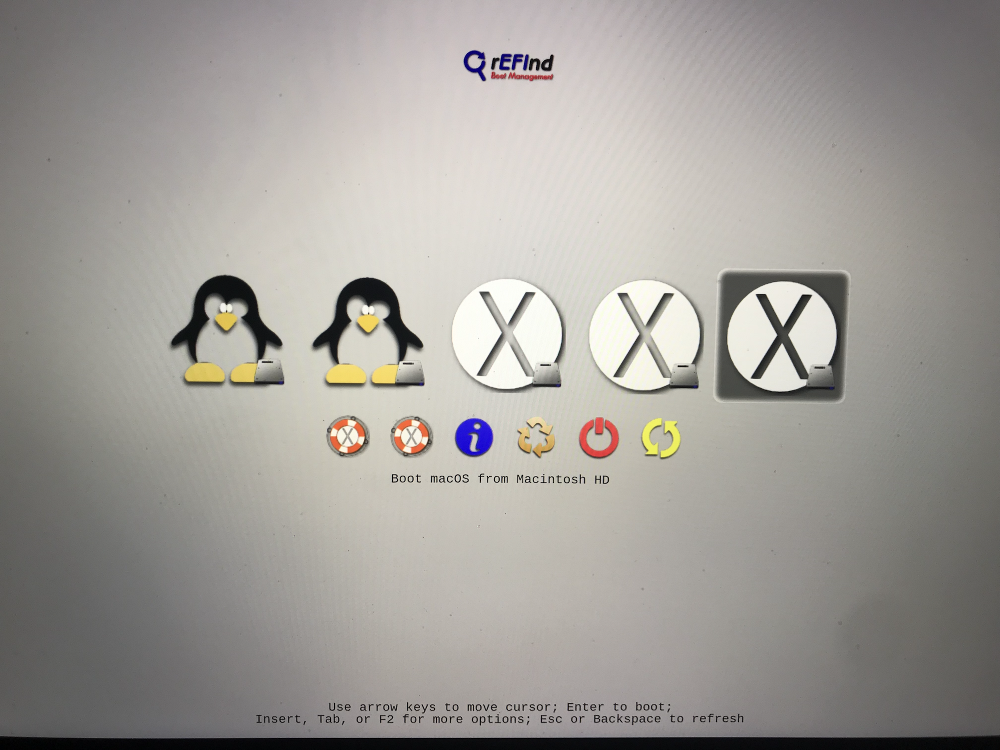
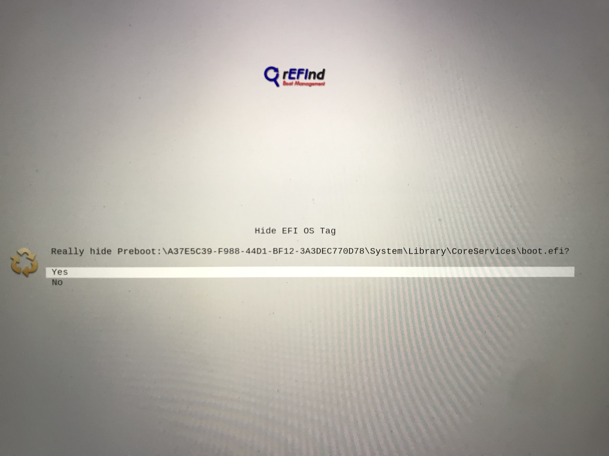
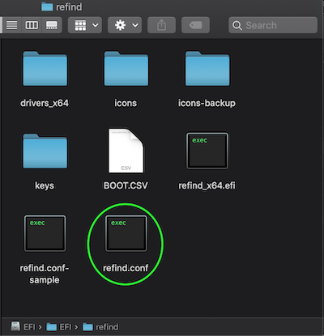
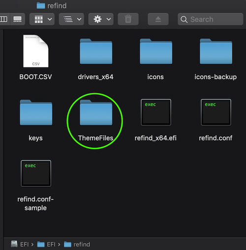
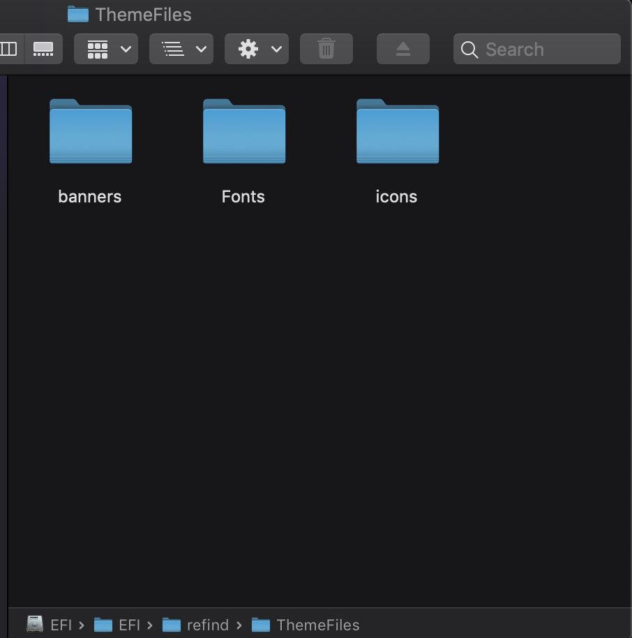
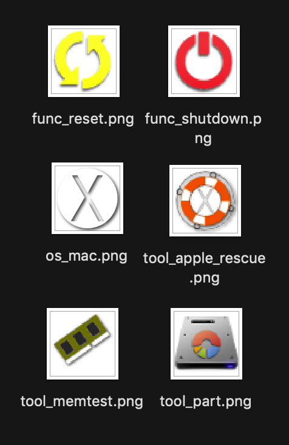
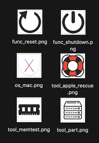
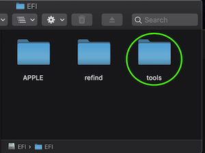

## Customizing rEFInd
***

### Removing Unwanted Boot Options

For the sake of clarity, I had my unwanted rEFInd boot options hidden throughout the making of this tutorial.

If I hadn't hidden my unwanted boot options, my rEFInd start up menu would look something like this:



These extra boot options are a result of rEFInd detecting all of the APFS volumes on your system.

To remove any unwanted boot options simply highlight the unwanted option and hit the minus key. After this you should be greeted with a prompt that looks like this:



After removing all of your unwanted boot options you should be left with something like this:


***
### Theming rEFInd

This will be just a brief introduction to theming rEFInd. For more information, please refer to rEFInd's official documentation bellow:

[Theming rEFInd](https://www.rodsbooks.com/refind/themes.html)

---

### Acessing refind.conf

To adjust the appearance of rEFInd we need to edit `refind.conf` located in `/Volumes/EFI/EFI/refind`.  To access this directory, we first need to mount our EFI partition.

To mount your EFI partition please refer to the ["Mounting Your EFI Partition" section on the previous page](bootlinux.md#efi123).

Once inside your EFI partition open up the folder titled `EFI` then open up the folder titled `refind`.  You should see something like this:



Right click on refind.conf and open it with your preferred text editor or, if you're comfortable, you can edit this file using the command line with the following commands:

`cd /Volumes/EFI/EFI/refind`

`nano refind.conf`

You'll notice this is a fairly large document with dozens of configurable settings. For the sake of this tutorial I'm just going to demonstrate the changes I made for my personal system.

---

### Adjusting Boot Timeout

When the rEFInd menu appears, you may notice a countdown timer below the default boot selection.  This timer automatically boots the default boot option after a certain amount of time unless the user presses the arrow keys.  I prefer to have this feature disabled but you can adjust it to your own preferences.  To do this I added `timeout 0` to refind.conf like so:

```
# Timeout in seconds for the main menu screen. Setting the timeout to 0
# disables automatic booting (i.e., no timeout). Setting it to -1 causes
# an immediate boot to the default OS *UNLESS* a keypress is in the buffer
# when rEFInd launches, in which case that keypress is interpreted as a
# shortcut key. If no matching shortcut is found, rEFInd displays its
# menu with no timeout.

timeout 0
```
---
### Hiding UI Elements

Some aspects of rEFInd's UI you may find to be unnecessary.  rEFInd allows you to hide these aspects if you prefer.

I chose to remove the device-type badges for boot options, the command summary at the bottom of rEFInd's menu, and the scroll arrows. (the scroll arrows never showed up for me in the first place for some reason but I chose to hide them anyway)

The following picture shows the UI elements that will be hidden:


To do this, I edited my `refind.conf` like so:

```
# Hide user interface elements for personal preference or to increase
# security:
#  banner      - the rEFInd title banner (built-in or loaded via "banner")
#  label       - boot option text label in the menu
#  singleuser  - remove the submenu options to boot macOS in single-user
#                or verbose modes; affects ONLY macOS
#  safemode    - remove the submenu option to boot macOS in "safe mode"
#  hwtest      - the submenu option to run Apple's hardware test
#  arrows      - scroll arrows on the OS selection tag line
#  hints       - brief command summary in the menu
#  editor      - the options editor (+, F2, or Insert on boot options menu)
#  badges      - device-type badges for boot options
#  all         - all of the above
# Default is none of these (all elements active)

hideui arrows hints badges
```
### Setting Custom Icons

In my opinion, rEFInd's default icons seem incredibly outdated and tend to look especially terrible on Retina displays. Luckily, to avoid confusing your modern computer with a 1992 Macintosh PowerBook we can tell rEFInd to use our own custom icon directory.


To do this, we need to create a folder within the refind folder located on the EFI partition.  I named my directory `ThemeFiles` and within it I created three subdirectories named `banner`, `Fonts`, and `icons` like so:





Next, we need to point rEFInd to our `icons` folder by editing refind.conf like so:

```
# Set the name of a subdirectory in which icons are stored. Icons must
# have the same names they have in the standard directory. The directory
# name is specified relative to the main rEFInd binary's directory. If
# an icon can't be found in the specified directory, an attempt is made
# to load it from the default directory; thus, you can replace just some
# icons in your own directory and rely on the default for others.
# Icon files may be in any supported format -- ICNS (*.icns), BMP (*.bmp),
# PNG (*.png), or JPEG (*.jpg or *.jpeg); however, rEFInd's BMP and JPEG
# implementations do not support transparency, which is highly desirable
# in icons.
# Default is "icons".

icons_dir ThemeFiles/icons
```

To override rEFInd's default icons our icons must have the same filename as the icons located in the default icon directory.

For example, these are some of the default icon files located in `/Volumes/EFI/EFI/refind/icons`



And these are some of my custom icons located in `/Volumes/EFI/EFI/refind/ThemeFiles/icons`



Notice that my custom icons have the exact same filename as the default icons.

It's important to note that you only need to include the icons you want to customize in your custom icon directory.  rEFInd will automatically use its default icons if one is not included in your custom icon folder.

### [You can check out the custom icons I used here](https://github.com/connollydean/Markdwon-Tutorial/blob/master/ThemeFiles/icons)
---
### Setting A Custom Background

To set a custom background for the rEFInd menu we first need to store our background file within the `refind` directory.

For example, I stored my background files in `/Volumes/EFI/EFI/refind/ThemeFiles/banners`

Next, we need to point rEFInd to the location of our background file by editing `refind.conf` like so:

```
# Use a custom title banner instead of the rEFInd icon and name. The file
# path is relative to the directory where refind.efi is located. The color
# in the top left corner of the image is used as the background color
# for the menu screens. Currently uncompressed BMP images with color
# depths of 24, 8, 4 or 1 bits are supported, as well as PNG and JPEG
# images. (ICNS images can also be used, but ICNS has limitations that
# make it a poor choice for this purpose.) PNG and JPEG support is
# limited by the underlying libraries; some files, like progressive JPEGs,
# will not work.

banner MyTheme/banners/banner2.png
```

We can also tell rEFInd how to handle our background image by editing `refind.conf` like so:

```
# Specify how to handle banners that aren't exactly the same as the screen
# size:
#  noscale     - Crop if too big, show with border if too small
#  fillscreen  - Fill the screen
# Default is noscale

banner_scale fillscreen
```


### [I've included a few of my personal background images here](https://github.com/connollydean/Markdwon-Tutorial/blob/master/ThemeFiles/banners)

---
### Setting A Custom Selection Background

The selection background is a transparent image that shows the user which rEFInd menu item is selected. Just like rEFInd's default icons, the default selection background tends to look terrible especially on Retina displays.

To set a custom selection background, we need to point rEFInd to our selection background image files.  I stored both my small and large size selection background images in `/Volumes/EFI/EFI/refind/ThemeFiles/icons`.  To set a custom selection background we need to edit `refind.conf` like so:

```
# Custom images for the selection background. There is a big one (144 x 144)
# for the OS icons, and a small one (64 x 64) for the function icons in the
# second row. If only a small image is given, that one is also used for
# the big icons by stretching it in the middle. If only a big one is given,
# the built-in default will be used for the small icons. If an image other
# than the optimal size is specified, it will be scaled in a way that may
# be ugly.
#
# Like the banner option above, these options take a filename of an
# uncompressed BMP, PNG, JPEG, or ICNS image file with a color depth of
# 24, 8, 4, or 1 bits. The PNG or ICNS format is required if you need
# transparency support (to let you "see through" to a full-screen banner).

selection_big   ThemeFiles/icons/selection_big.png
selection_small  ThemeFiles/icons/selection_small.png
```

### [I've included my personal selection background files here](https://github.com/connollydean/Markdwon-Tutorial/blob/master/ThemeFiles/icons)

---
### Setting A Custom Font

To set a custom font we need to save a font file in the form of a .PNG image somewhere in our rEFInd directory.  I stored my custom font file in `/Volumes/EFI/EFI/refind/ThemeFiles/Fonts`.  To set this font we need to edit `refind.conf` like so:

```
# Set the font to be used for all textual displays in graphics mode.
# For best results, the font must be a PNG file with alpha channel
# transparency. It must contain ASCII characters 32-126 (space through
# tilde), inclusive, plus a glyph to be displayed in place of characters
# outside of this range, for a total of 96 glyphs. Only monospaced fonts
# are supported. Fonts may be of any size, although large fonts can
# produce display irregularities.
# The default is rEFInd's built-in font, Luxi Mono Regular 12 point.

font MyTheme/Fonts/extralight46.png
```
### [I've included my personal custom font files here](https://github.com/connollydean/Markdwon-Tutorial/blob/master/ThemeFiles/Fonts)

---

### Customizing rEFInd Tools

The tools displayed on the rEFInd menu are located below the boot options.  rEFInd allows you to customize these tools to your personal preference. To include or exclude a tool we need to edit `refind.conf` like so:

```
# Which non-bootloader tools to show on the tools line, and in what
# order to display them:
#  shell            - the EFI shell (requires external program; see rEFInd
#                     documentation for details)
#  memtest          - the memtest86 program, in EFI/tools, EFI/memtest86,
#                     EFI/memtest, EFI/tools/memtest86, or EFI/tools/memtest
#  gptsync          - the (dangerous) gptsync.efi utility (requires external
#                     program; see rEFInd documentation for details)
#  gdisk            - the gdisk partitioning program
#  apple_recovery   - boots the Apple Recovery HD partition, if present
#  windows_recovery - boots an OEM Windows recovery tool, if present
#                     (see also the windows_recovery_files option)
#  mok_tool         - makes available the Machine Owner Key (MOK) maintenance
#                     tool, MokManager.efi, used on Secure Boot systems
#  csr_rotate       - adjusts Apple System Integrity Protection (SIP)
#                     policy. Requires "csr_values" to be set.
#  about            - an "about this program" option
#  hidden_tags      - manage hidden tags
#  exit             - a tag to exit from rEFInd
#  shutdown         - shuts down the computer (a bug causes this to reboot
#                     many UEFI systems)
#  reboot           - a tag to reboot the computer
#  firmware         - a tag to reboot the computer into the firmware's
#                     user interface (ignored on older computers)
#  fwupdate         - a tag to update the firmware; launches the fwupx64.efi
#                     (or similar) program
#  netboot          - launch the ipxe.efi tool for network (PXE) booting
# Default is shell,memtest,gdisk,apple_recovery,windows_recovery,mok_tool,about,hidden_tags,shutdown,reboot,firmware,fwupdate

showtools memtest, gdisk, csr_rotate, apple_recovery, reboot, shutdown
```
Note: The order in which the tools are listed in `refind.conf` will be displayed in the same order on the rEFInd menu.

Note: It's best not to hide the `hidden_tags` tool until after you've successfully removed any unwanted boot options as shown at the top of this page.

---
### Adjusting Apple's System Integrated Protection (SIP) On The Fly With The `csr_rotate` Tool

As shown previously in this tutorial, to disable and enable SIP you are forced to boot into Recovery Mode.  However, rEFInd's `csr_rotate` tool allows you to quickly and easily adjust SIP right from the boot menu. To enable this we need to edit `refind.conf` like so:

```
# Set the CSR values for Apple's System Integrity Protection (SIP) feature.
# Values are one-byte (two-character) hexadecimal numbers. These values
# define which specific security features are enabled. Below are the codes
# for what the values mean. Add them up (in hexadecimal!) to set new values.
# Apple's "csrutil enable" and "csrutil disable" commands set values of 10
# and 77, respectively.
#   CSR_ALLOW_UNTRUSTED_KEXTS       0x01
#   CSR_ALLOW_UNRESTRICTED_FS       0x02
#   CSR_ALLOW_TASK_FOR_PID          0x04
#   CSR_ALLOW_KERNEL_DEBUGGER       0x08
#   CSR_ALLOW_APPLE_INTERNAL        0x10
#   CSR_ALLOW_UNRESTRICTED_DTRACE   0x20
#   CSR_ALLOW_UNRESTRICTED_NVRAM    0x40

csr_values 10,77
```
As you can see, you are actually able to adjust each of SIP's specific security features with this tool. I chose the default setting `csr_values 10,77` to disable and enable SIP on all security features.  This will replicate exactly the `csrutil enable` and `csrutil disable` commands we used in Recovery Mode earlier in this tutorial.

Now just simply select the `csr_rotate` tool in the rEFInd menu and hit enter to adjust your SIP settings.

Note: Make sure you have `csr_rotate` listed in 'showtools' or else the tool won't appear in the rEFInd menu.

---
### Adding Additional Tools To rEFInd

This part is optional as you will probably never have a need for these extra tools but I like to have them there just in case I need them in the future.  

There are two different tools that can be added to rEFInd.  

The first is Memtest86. This program offers an array of hardware testing tools in a standalone environment.  

The second tool is gdisk.  gdisk is a standalone drive management and partitioning tool developed by Rod Smith, the creator of rEFInd.  

Similar to Super Grub2 Disk, Memtest86 and gdisk are standalone EFI tools meaning they don't require an OS to run.

### [You can download the Memtest86 and gdisk .EFI files here]()


To install these tools first navigate to `/Volumes/EFI/EFI/tools` as shown below:




***
## [Back To Home Page](https://github.com/connollydean/Markdwon-Tutorial/blob/master/README.md)
