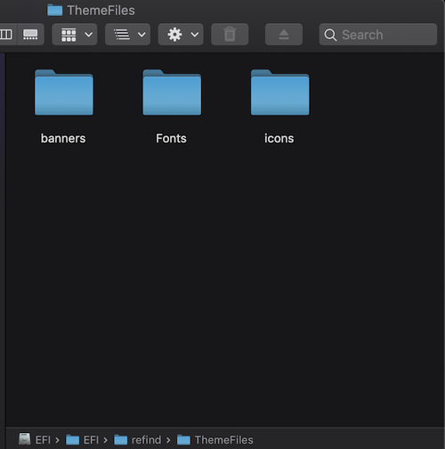

## Customizing rEFInd
***

### Removing Unwanted Boot Options

For the sake of clarity, I had my unwanted rEFInd boot options hidden throughout the making of this tutorial.

If I hadn't hidden my unwanted boot options, my rEFInd start up menu would look something like this:


These extra boot options are a result of rEFInd detecting all of the APFS volumes on your system.

To remove any unwanted boot options simply highlight the unwanted option and hit the minus key. After this you should be greeted with a prompt that looks like this:


After removing all of your unwanted boot options you should be left with something like this:


***
### Theming rEFInd

This will be just a brief introduction to theming rEFInd. For more information, please refer to rEFInd's official documentation bellow:

[Theming rEFInd](https://www.rodsbooks.com/refind/themes.html)

#### Acessing refind.conf

To adjust the appearance of rEFInd we need to edit `refind.conf` located in `/Volumes/EFI/EFI/refind`.  To access this directory, we first need to mount our EFI partition.

To mount your EFI partition please refer to the ["Mounting Your EFI Partition" section on the previous page](bootlinux.md#efi123).

Once inside your EFI partition open up the folder titled `EFI` then open up the folder titled `refind`.  You should see something like this:


Right click on refind.conf and open it with your preferred text editor or, if you're comfortable, you can edit this file using the command line with the following commands:

`cd /Volumes/EFI/EFI/refind`

`nano refind.conf`

You'll notice this is a fairly large document with dozens of configurable settings. For the sake of this tutorial I'm just going to demonstrate the changes I made for my personal system.

#### Adjusting Boot Timeout

When the rEFInd menu appears, you may notice a countdown timer below the default boot selection.  This timer automatically boots the default boot option after a certain amount of time unless the user presses the arrow keys.  I prefer to have this feature disabled but you can adjust it to your own preferences.  To do this I added `timeout 0` to refind.conf like so:

```
# Timeout in seconds for the main menu screen. Setting the timeout to 0
# disables automatic booting (i.e., no timeout). Setting it to -1 causes
# an immediate boot to the default OS *UNLESS* a keypress is in the buffer
# when rEFInd launches, in which case that keypress is interpreted as a
# shortcut key. If no matching shortcut is found, rEFInd displays its
# menu with no timeout.

timeout 0
```

#### Hiding UI Elements

Some aspects of rEFInd's UI you may find to be unnecessary.  rEFInd allows you to hide these aspects if you prefer.

I chose to remove the device-type badges for boot options, the command summary at the bottom of rEFInd's menu, and the scroll arrows. (the scroll arrows never showed up for me in the first place for some reason but I chose to hide them anyway)

The following picture shows the UI elements that will be hidden:


To do this, I edited my refind.conf like so:

```
# Hide user interface elements for personal preference or to increase
# security:
#  banner      - the rEFInd title banner (built-in or loaded via "banner")
#  label       - boot option text label in the menu
#  singleuser  - remove the submenu options to boot macOS in single-user
#                or verbose modes; affects ONLY macOS
#  safemode    - remove the submenu option to boot macOS in "safe mode"
#  hwtest      - the submenu option to run Apple's hardware test
#  arrows      - scroll arrows on the OS selection tag line
#  hints       - brief command summary in the menu
#  editor      - the options editor (+, F2, or Insert on boot options menu)
#  badges      - device-type badges for boot options
#  all         - all of the above
# Default is none of these (all elements active)

hideui arrows hints badges
```
#### Setting Custom Icons

In my opinion, rEFInd's default icons seem incredibly outdated and tend to look especially terrible on Retina displays. Luckily, to avoid confusing your modern computer with a 1992 Macintosh PowerBook we can tell rEFInd to use our own custom icon directory.


To do this, we need to create a folder within the refind folder located on the EFI partition.  I named my directory `ThemeFiles` and within it I created three subdirectories named `banner`, `Fonts`, and `icons` like so:




Next, we need to point rEFInd to our `icons` folder by editing refind.conf like so:

```
# Set the name of a subdirectory in which icons are stored. Icons must
# have the same names they have in the standard directory. The directory
# name is specified relative to the main rEFInd binary's directory. If
# an icon can't be found in the specified directory, an attempt is made
# to load it from the default directory; thus, you can replace just some
# icons in your own directory and rely on the default for others.
# Icon files may be in any supported format -- ICNS (*.icns), BMP (*.bmp),
# PNG (*.png), or JPEG (*.jpg or *.jpeg); however, rEFInd's BMP and JPEG
# implementations do not support transparency, which is highly desirable
# in icons.
# Default is "icons".

icons_dir ThemeFiles/icons
```

To override rEFInd's default icons our icons must have the same filename as the icons located in the default icon directory.

For example, these are some of the default icon files located in `/Volumes/EFI/EFI/refind/icons`


And these are some of my custom icons located in `/Volumes/EFI/EFI/refind/ThemeFiles/icons`


Notice that my custom icons have the exact same filename as the default icons.

It's important to note that you only need to include the icons you want to customize in your custom icon directory.  rEFInd will automatically use its default icons if one is not included in your custom icon folder.

#### [You can check out the custom icons I used here](https://github.com/connollydean/Markdwon-Tutorial/blob/master/ThemeFiles/icons)


***
## [Back To Home Page](https://github.com/connollydean/Markdwon-Tutorial/blob/master/README.md)
