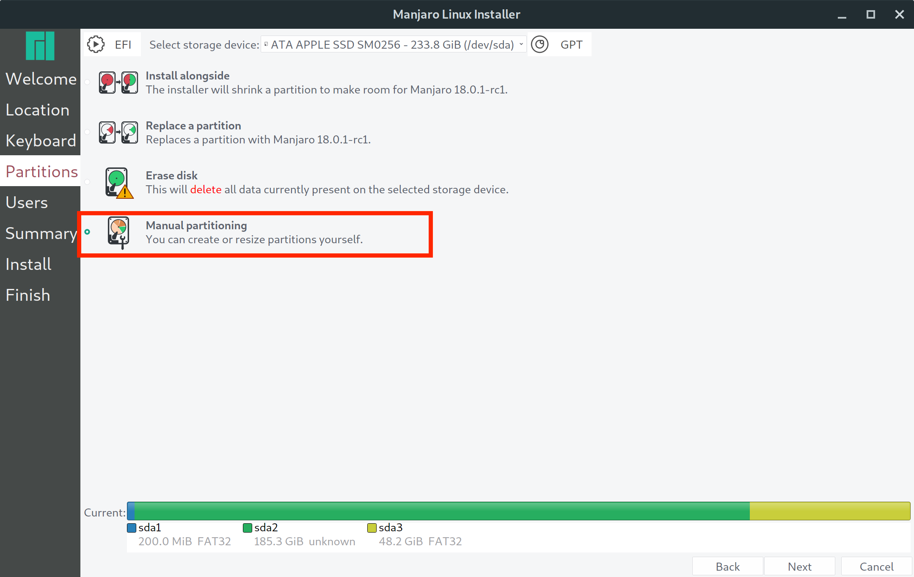

## Installing Linux
***

### Before you begin

This tutorial is focused on getting Linux to boot on your Apple hardware. Therefore, this part of the tutorial will only go into detail on installing Linux to the proper partition and choosing the right filesystem.  For more information on configuring your Linux install please refer to your distribution's documentation.

### Boot into your Linux Installer

Use the arrow keys to select your USB drive, then hit enter to boot into the installer.

I'm using Manjaro Linux for this tutorial and this is what it looked like when it started up:

Next, I clicked launch installer. I first selected my time zone then I configured my keyboard like so:

After this, we need to select the option to manually partition our drive like so:

Next we need to select and format the partition we created earlier. This is what my partitions looked like in the Manjaro installer:

Earlier, I created a ~50 GB FAT32 partition for my Linux installation.  This is where we have to carefully make sure we are selecting the right partition to install to.  As you can see '/dev/sda3' is about 50 GB and is formatted in the FAT32 filesystem.

With the correct partition selected, I clicked on "edit" in the bottom right of the window to configure my partition like so:

Notice here we need to format the partition to the `ext4` filesystem and set the mount point to `/`.

This will format our partition to the 'ext4' filesystem which is especially designed for Linux.  Also, by setting the mount point to '/', we are telling the installer to install the entire system to this partition. After the partition has been configured you should see something like this:

After this you'll be asked to create a user account and then you are shown an installation summary like so:

If everything looks correct then you can click on "Install"

You will probably get a warning that looks something like this:

This is O.K. as we will be fixing this later.

Continue with the installation until it is complete like so:

You now have Linux installed on your partition and can move on to the next page.
***

## [Next Page: Booting Linux](bootlinux.md)

## [Back To Home](https://github.com/connollydean/Markdwon-Tutorial/README.md)
