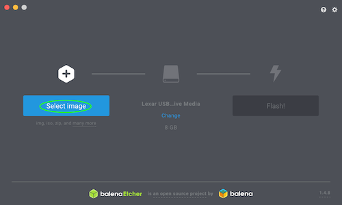

# Creating A Bootable Linux USB Drive
***

## Choosing A Linux OS

There are thousands of different Linux distributions to choose from. I suggest choosing a distro that has good support and a strong community thats also within your skill level.

### Helpful Article: [How To Choose The Best Linux Distro For Your Needs](https://www.lifewire.com/choose-best-linux-distro-for-needs-2201172)

### Popular Choices:


### 1. Ubuntu


#### Skill Level: Beginner

Ubuntu is a great option for users who are just getting their feet wet with Linux. It's easy to install and is as stable as it gets. Perhaps you could think of Ubuntu as the Linux distro that your grandma could use. Ubuntu includes a GUI installation

#### [Ubuntu Home Page](https://www.ubuntu.com/download/desktop)

### 2. Manjaro


#### Skill Level: Intermediate

Manjaro Linux is great option for those of you that have some Linux experience but would also like to avoid pulling your own hair out. This distro comes in many different versions in the form of both official releases and community releases. Manjaro includes a GUI installation.

#### [Manjaro Home Page](https://manjaro.org/)

### 3. Arch


#### Skill Level: Expert

Many expert Linux users swear by Arch Linux. Arch Linux is designed to give you everything you need and nothing you don't. Arch Linux does NOT include a GUI installation which means everything must be manually installed and configured from the command line. I've installed Arch Linux once before and I found myself sitting next to my router on the floor of my roommate's closet trying to manually configure a WPA connection. So if you're comfortable starting out with nothing but a command line interface then this is the distro for you.

#### [Arch Linux Home Page](https://www.archlinux.org/)

##  Downloading And Verifying your ISO

For the sake of this tutorial I am going to be installing Manjaro Linux. Most Linux OSs are distributed as .ISO disk images.

For example my Manjaro image is called `manjaro-gnome-18.0.1-rc1-stable-x86_64.iso`.  

This file is around 2 GB in size which is why it is important we make sure this file is in perfect condition before we continue with installing it.

To verify that this file has not been altered or corrupted, we need to verify its hash. Most Linux distros will display the correct hashes on their download page.  For this example we'll be verifying a SHA1 hash but there is a selection of different types of hash types such as MD5 and SHA256.  The correct SHA1 hash for my file was the following:

`a19b8c306514cdb13b818ba63e1c94f74daa5155`

To verify your .iso file, open up terminal and use the `shasum` command followed by the location of your .ISO file like so:
```
Connollys-MacBook-Pro:~ connollydean$ shasum /Users/connollydean/Desktop/Extras/manjaro-gnome-18.0.1-rc1-stable-x86_64.iso     
a19b8c306514cdb13b818ba63e1c94f74daa5155  
```
As you can see, the two SHA1 hashes match which tells us we have a safe and clean download of our .ISO image file and you can move on to the next step.

Alternatively, you could use a GUI application to verify the hash of your file such as the [Checksum App](https://itunes.apple.com/us/app/checksum/id1371978119?mt=12), free on the Mac App Store

## Preparing Your USB Drive

Before we can flash the .ISO image to your USB drive, we need to format it to the FAT32 filesystem.

First open up Disk Utility and select your USB drive from the list of drives on the left. Then click the button that says `Erase` as shown below:


Next, name the drive whatever you want and select `MS-DOS (FAT)` in the `Format` menu as shown below:


Finally, click `Erase` and your USB drive should now be ready for the .ISO disk image.

## Flashing The .ISO Image To The USB Drive

There are many ways to flash an image to a USB drive but for the sake of this tutorial we'll be using a program called Etcher.

[You can download the Etcher application here](https://www.balena.io/etcher/)

First, open up Etcher and click `Select image`.



Next, navigate to your .iso image and hit `Open` like so:


Finally, make sure your correct USB drive is selected and click `Flash!`.  Let the program flash the image.


If the image was flashed successfully, you should get a warning stating the "disk is not readable".


Finally, with your USB drive still plugged in, reboot your computer to see if rEFInd has detected your bootable drive. If it does, you should see something that looks similar to this:


You now have a bootable Linux USB drive and you're ready to move on to the next page.

***
## [Next Page: Installing Linux](linuxinstall.md)

## [Back To Home](https://github.com/connollydean/Markdwon-Tutorial/blob/master/README.md)
