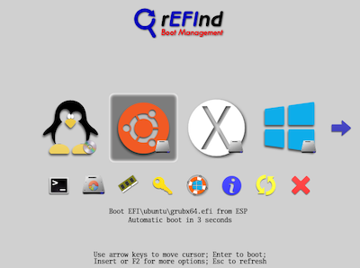
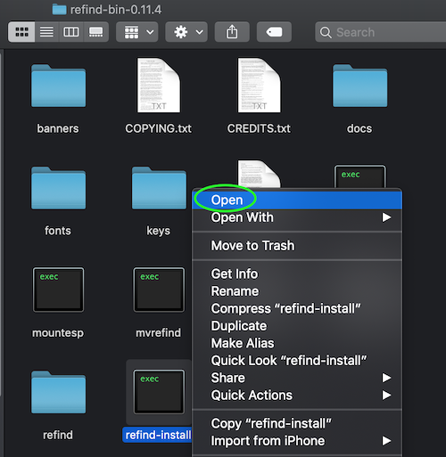
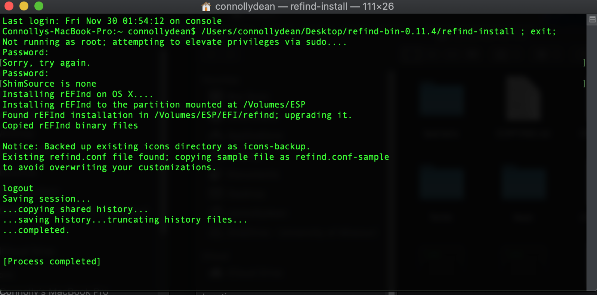
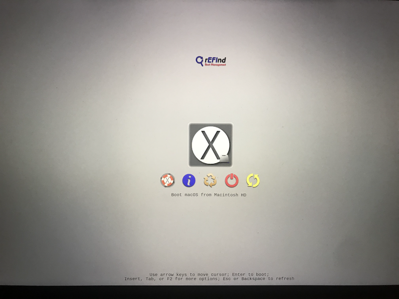

# Installing rEFInd on MacOS
***

## About rEFInd

rEFInd is a custom boot manager designed for UEFI based computers. rEFInd detects bootable drives on your system and displays them in a menu as shown below. We'll be using rEFInd to select your OS during every start up.



#### Note: [The rEFInd website has lots of helpful information worth taking a look at](https://www.rodsbooks.com/refind/)

## Disabling System Integrity Protection

Before we can install rEFInd, we have to temporarily disable System Integrity Protection (SIP).  SIP is security technology that helps protect your Mac from malicious software by limiting access to certain parts of MacOS.

[Here's more info on SIP](https://support.apple.com/en-us/HT204899)

To disable SIP we need to boot into Recovery Mode. SIP can only be disabled from Recovery Mode but you can check the status of SIP by using the terminal command `csrutil status`.   

To disable SIP, shut down your Mac and boot up again while holding `⌘ + R`.  Once you've booted into Recovery Mode, click on Utilities and open up Terminal as shown below.


Next, simply type `csrutil disable` into the terminal and hit enter.  After this you can restart your system by typing `reboot` into the terminal.

Finally, once your Mac reboots use the command `csrutil status` to check if you've successfully disabled SIP.  You should see something similar to the following:
```
Connollys-MBP:~ connollydean$ csrutil status   
System Integrity Protection status: disabled.
```
To enable SIP again, simply follow the same process but instead use the command `csrutil enable`

## Installing rEFInd

Now that SIP has been disabled, we can continue with installing rEFInd.

First, download the latest version of rEFInd from [this link](https://sourceforge.net/projects/refind/)

Next, open up the refind-bin folder and right-click on the file named "refind-install" then click open as shown below:



This will open up a terminal window and ask you for your password. Type in your password and hit enter to complete the installation.  The result of this should look similar to the image below:



Now that the installation is complete, reboot your computer to check if it was successful. If you followed the steps correctly your Mac should boot into a screen that looks something like this:



*NOTE - You may see multiple Mac boot options on this screen such as "Boot MacOS from Preboot". Not to worry, this is just a side-affect of the APFS filesystem and any unwanted boot options can be hidden later.*

Now that rEFInd has been installed you can now re-enable SIP if you choose and continue on to the next page.

***

## [Next Page: Creating A Bootable Linux USB Drive](linuxusb.md)

## [Back To Home Page](https://github.com/connollydean/Markdwon-Tutorial/blob/master/README.md)
